# spring-study
学习spring源码，加注释

## 1、下载Spring源码


## 2、搭建gradle环境

本次阅读的spring版本为`5.3.10`，查看`gradle->wrapper->gradle-wrapper.properties`，官方指定gradle版本为`gradle-6.8.3`，因为gradle每次编译都会从官网下载指定版本，可下载到本地之后，修改`distributionUrl`为本地路径，这样就不会每次都下载了

下载gradle后解压到本地
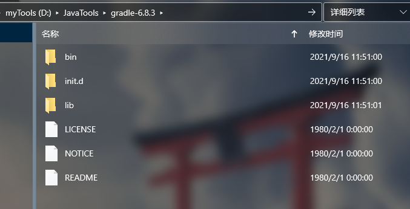


设置环境变量:
`GRADLE_HOME`=解压目录
path新增`%GRADLE_HOME%\bin\`
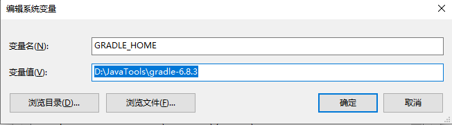
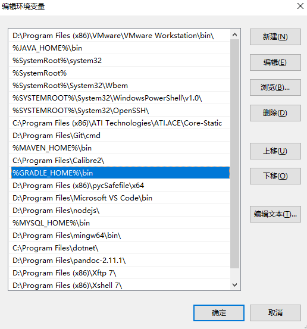


控制台查看：`gradle -v`
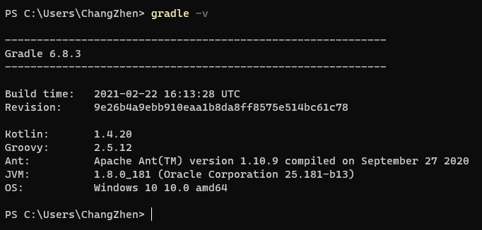

到此gradle安装成功

## 3、IDEA配置Gradle
如图，配置Gradle用户主目录（相当于本地Maven仓库）,gradle编译项目所依赖的jar都会下载后放入这个目录中，使用的gradle选择刚配置好的文件夹。JDK至少是JDK8，此处选择默认8。
构建并运行选择IDEA，如果选择Gradle每次都会跑一堆Task
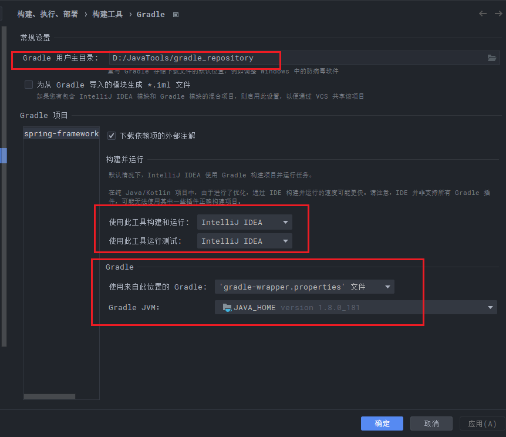


`gradle-wrapper.properties` 中修改`distributionUrl`为本地路径，这样就不会每次都下载了
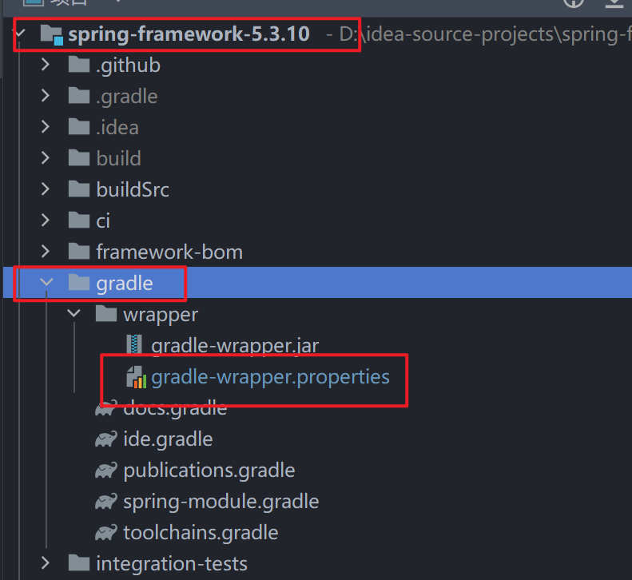

```groovy
distributionUrl=file:///D:/JavaTools/gradle-6.8.3-bin.zip
```


打开根目录的`build.gradle`文件(这个就相当于是maven的pom文件),在文件头部加上

```groovy
buildscript {
    repositories {
        maven { url "https://repo.spring.io/plugins-release" }
    }
}
```
如图：
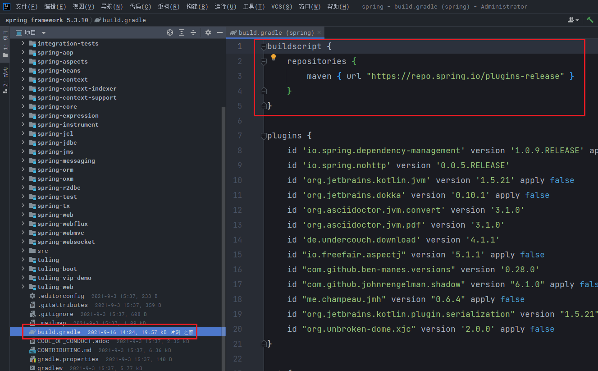


然后往下继续寻找,找到如下代码段:

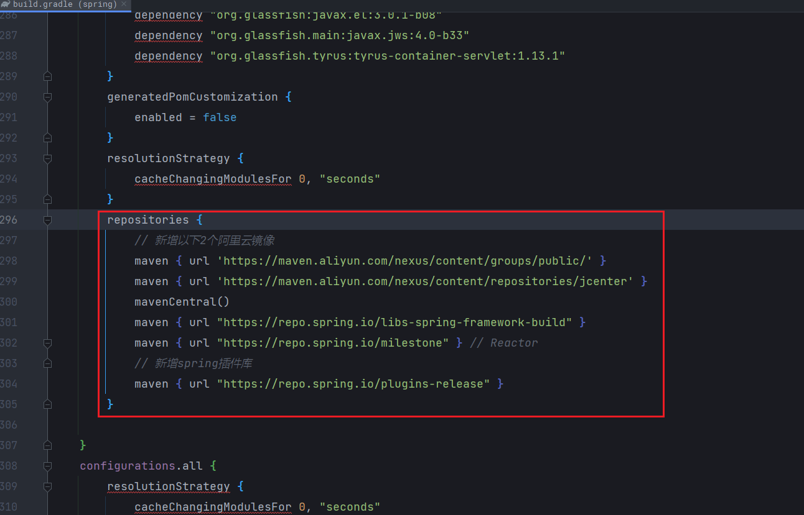


添加阿里云镜像和spring的插件库,这里的镜像和我们配置maven的镜像是一样的,目的就是加快依赖包的下载速度,如果不配置镜像的话,可能会编译几个小时。
具体修改如下:

```groovy
repositories {
    // 新增以下2个阿里云镜像
    maven { url 'https://maven.aliyun.com/nexus/content/groups/public/'}
    maven { url 'https://maven.aliyun.com/nexus/content/repositories/jcenter' }
    mavenCentral()
    maven { url "https://repo.spring.io/libs-spring-framework-build" }
    maven { url "https://repo.spring.io/milestone" } // Reactor
    // 新增spring插件库
    maven { url "https://repo.spring.io/plugins-release" }
}
```


修改保存后会自动开始构建。
等待一定时间后,构建完毕!(注意:这里只是把依赖包下载下来,其实还没有真正开始编译)
如果构建失败重新refresh几次就行了,一般就是包下载超时之类的错误。

构建成功之后,找到 `ApplicationContext`类
打开后,按下Ctrl+Alt+U键,如果出现下图所示类图界面说明构建成功了!(构建过程就是找依赖对象的过程)
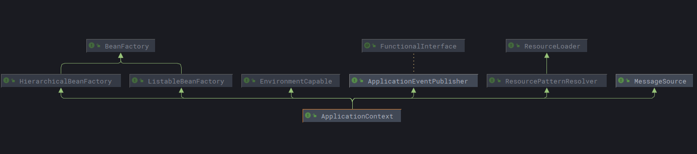

此时可以查看Spring的源码了,但是我们需要在源码的基础上面进行修改,开发,调试,添加注释等等
操作,所以需要将源码进行编译打包,下面就是将源码编译的过程。


## 4、编译源码

1. 在构建完成源码之后,就搭建好了阅读源码的环境了,此时我们还需要将源码编译打包。
   在编译之前需要进行一些配置修改,可以查看`import-into-idea.md`文档。
   如图：
   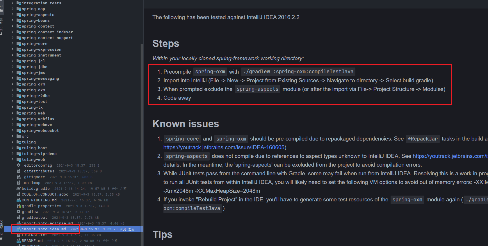


2. 文档要求先编译 `spring-oxm` 下的 `compileTestJava` ,点击右上角gradle打开编译视图,找到spring-oxm模块,然后在other下找到compileTestjava,双击即可!
   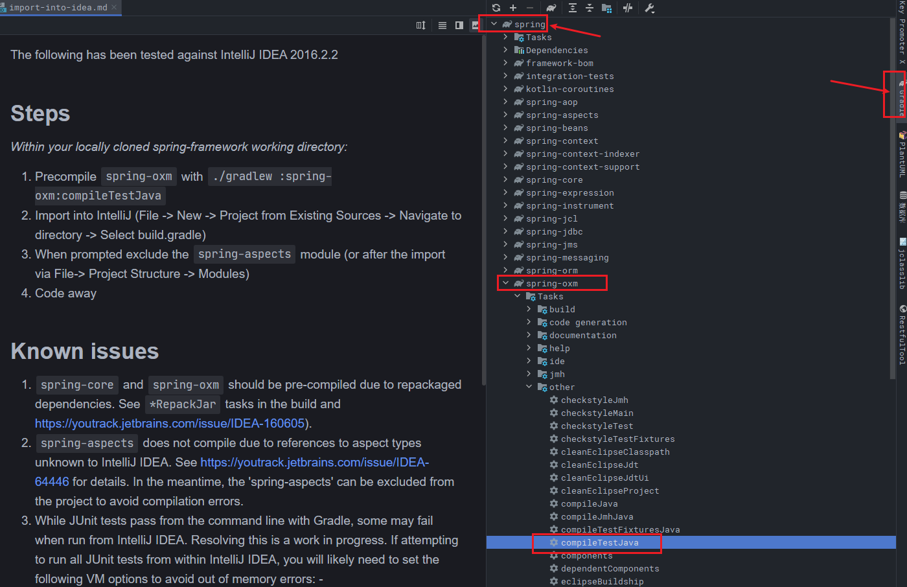


​	编译成功：由于源码被编辑过，会有部分注释报错，用git clone的没问题
​	


3. 保险起见再编译下spring-core模块,因为之后的spring-context依赖于core,方法同上。
   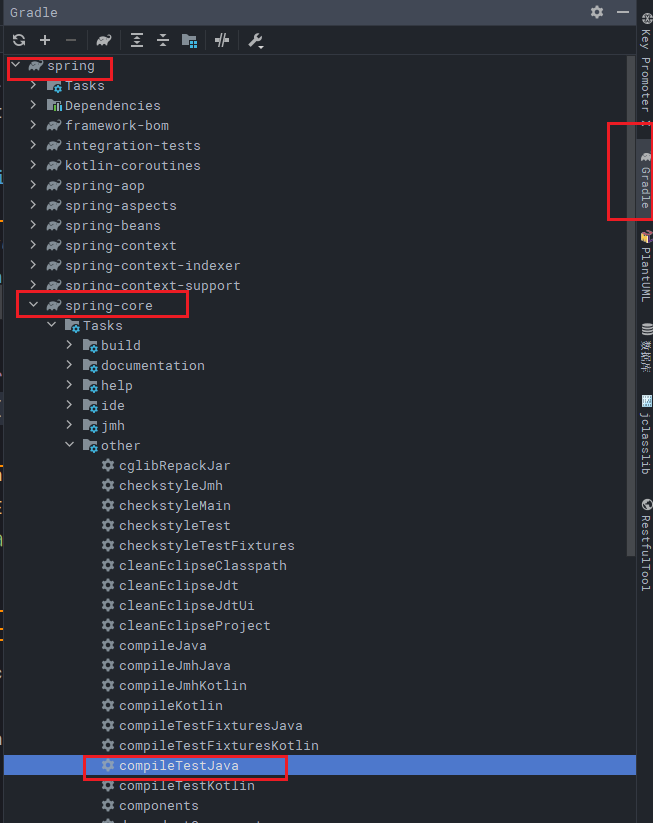


4. 都编译完成且成功之后,开始编译整个工程(这个过程非常耗时间,可能10-20分钟!) ，如下图
   打开顶层spring->build->build
   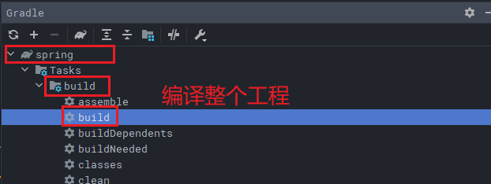
   经过一段时间编译,build成功!(每个人电脑的性能不一样,所需时间也不一样)


##  5、源码测试

1. 完成了上面的过程后,我们可以自己编写一个模块测试该源码构建编译过程是否真正成功完成!

步骤:【File】->【New】->【Module...】
在Spring中添加自己的module模块,同样选择gradle构建。


2. 新模块Parent:spring, Name:my-test(测试模块作为spring源码的子模块添加进来,下面的配置默认即可)

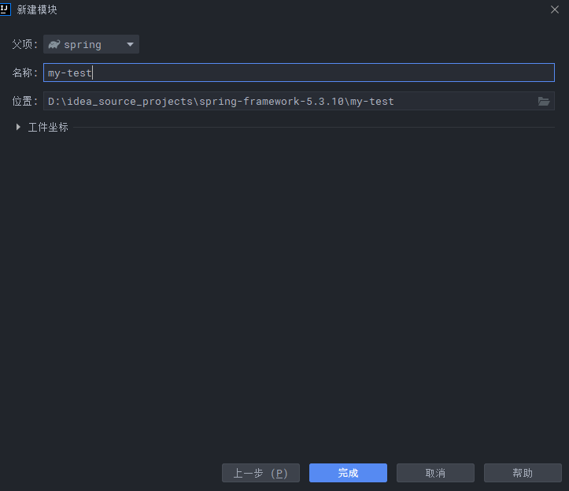


3. Finish,idea会自动帮助我们构建my-test模块

打开全局配置文件:`settings.gradle`文件,拉到最下面,我们看到系统自动加上了my-test模块
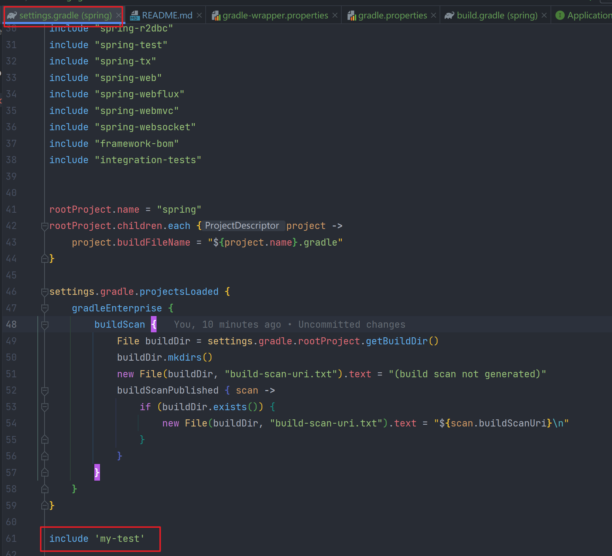


找到我们自己的测试模块my-test,打开build.gradle文件(相当于是pom文件),默认dependencies依赖(这里的dependencies和maven里的依赖是一样的)只有一个junit,我们需要手工添加spring-context,spring-beans,spring-core,spring-aop这4个核心模块,具体如下:

```groovy
dependencies {
     // 添加完要构建一下,否则代码中无法引用
    compile(project(":spring-context"))
    compile(project(":spring-beans"))
    compile(project(":spring-core"))
    compile(project(":spring-aop"))
    
    testImplementation 'org.junit.jupiter:junit-jupiter-api:5.7.0'
    testRuntimeOnly 'org.junit.jupiter:junit-jupiter-engine:5.7.0'
}
```
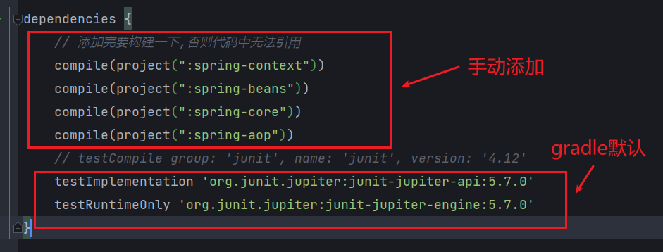


gradle中使用lombok
在工程模块下的build.gradle中的dependencies中添加依赖

```groovy
implementation 'org.projectlombok:lombok:1.18.20'
annotationProcessor 'org.projectlombok:lombok:1.18.20'
```

4. 下面编写一个简单的applicationContext获取容器用的bean,主要是测试Spring源码构建编译过程是否成功!

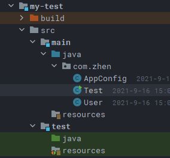

新建一个实体类User.java
```java
package com.zhen;

import java.util.StringJoiner;

public class User {

	private Long id;
	private String name;

	public User() {
	}

	public User(Long id, String name) {
		this.id = id;
		this.name = name;
	}

	public Long getId() {
		return id;
	}

	public void setId(Long id) {
		this.id = id;
	}

	public String getName() {
		return name;
	}

	public void setName(String name) {
		this.name = name;
	}

	@Override
	public String toString() {
		return new StringJoiner(", ", User.class.getSimpleName() + "[", "]")
				.add("id=" + id)
				.add("name='" + name + "'")
				.toString();
	}
}

```


新建AppConfig.java(使用注解的方式声明bean)

```java
package com.zhen;

import org.springframework.context.annotation.Bean;
import org.springframework.context.annotation.ComponentScan;
import org.springframework.context.annotation.Configuration;

@Configuration
@ComponentScan
public class AppConfig {

	@Bean
	public User user() {
		return new User(1L, "ChangZhen");
	}
}

```


写一个测试类Test.java

```java
package com.zhen;

import org.springframework.context.annotation.AnnotationConfigApplicationContext;

public class Test {

	public static void main(String[] args) {
		AnnotationConfigApplicationContext context = new AnnotationConfigApplicationContext(AppConfig.class);
		User user = (User) context.getBean("user");
		System.out.println(user);
	}
}

```

运行, console输出
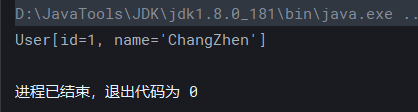


## 遇坑总结：

如果是下载其他git的zip包还会报错
fatal: not a git repository (or any of the parent directories): .git
Process 'command 'git'' finished with non-zero exit value 128
把构建并运行默认的Gradle修改为IDEA


### 1、CoroutinesUtils找不到该类

错误信息:
Error:(354, 51) java: 找不到符号
符号: 变量 CoroutinesUtils
位置: 类 org.springframework.core.ReactiveAdapterRegistry.CoroutinesRegistrar
解决方案:
点击【File】 ->【 Project Structure】 -> 【Libraries】 -> 【+】 -> 【Java】,然后选择spring-
framework/spring-core/kotlin-coroutines/build/libs/kotlin-coroutines-5.3.0-SNAPSHOT.jar,在弹出
的对话框中选择spring-core.main,再重新build项目即可。
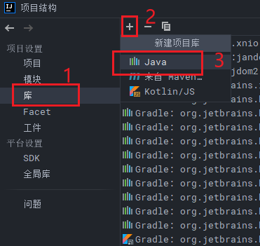

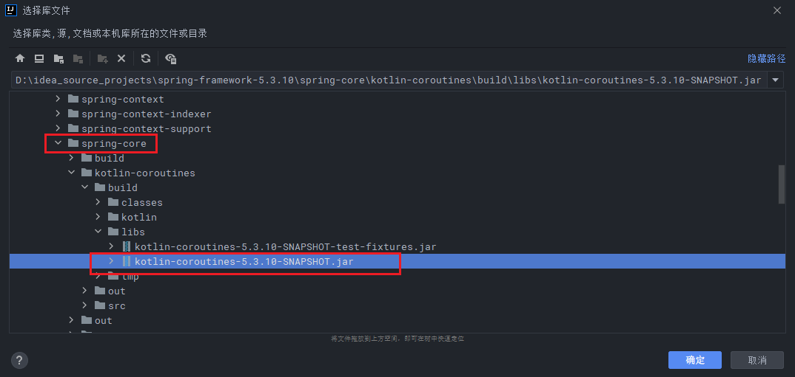


### 2、InstrumentationSavingAgent找不到该类

错误信息:
Error:(26, 38) java: 找不到符号
符号: 类 InstrumentationSavingAgent
位置: 程序包 org.springframework.instrument
解决方案:
修改spring-context模块下的spring-context.gradle文件,找到optional(project(":spring-
instrument")),将optional改为compile
```java
//optional改为compile,否则报错:找不到InstrumentationSavingAgent
//optional(project(":spring-instrument"))
compile(project(":spring-instrument"))
```


### 3、H2DatabasePopulatorTests > executesHugeScriptInReasonableTime() FAILED

错误信息:
H2DatabasePopulatorTests > executesHugeScriptInReasonableTime() FAILED
解决方案:
3修改spring-jdbc模块下的spring-jdbc.gradle文件,找到optional("com.h2database:h2"),将optional改成compile
```java
// 报错:H2DatabasePopulatorTests > executesHugeScriptInReasonableTime() FAILED
//解决方案:将optional换成compile
//optional("com.h2database:h2")
compile("com.h2database:h2")
```
### 4、header.mismatch [SpringHeader]
该错误是修改完以上3个问题后重新对整个工程进行重新编译时报的错, 这个错是我们新建的my-testt模块报的错
这个错误其实无关紧要,是格式错误,所以可以忽略,不要管它,也用不着重新编译,我们可以直接执Test.java中的main方法。
如果非要全部编译成功才肯罢休,那么可以尝试修改全局配置文件,在编译的时候把spring-mytest模块剔除在外。


## 附:spring源代码各个模块作用

## 主要模块:
spring-core:核心模块 依赖注入IOC和DI的最基本实现
spring-beans:Bean工厂与装配
spring-context:上下文,即IOC容器
spring-context-support:对IOC的扩展,以及IOC子容器
spring-context-indexer:类管理组件和Classpath扫描
spring-expression:表达式语句
### 切面编程:
spring-aop:面向切面编程,CGLIB,JDKProxy
spring-aspects:集成AspectJ,Aop应用框架
spring-instrument:动态Class Loading模块
### 数据访问与集成:
spring-jdbc:提供JDBC主要实现模块,用于简化JDBC操作
spring-tx:spring-jdbc事务管理
spring-orm:主要集成Hibernate,jpa,jdo等
spring-oxm:将java对象映射成xml数据或将xml映射为java对象
spring-jms:发送和接受消息
### web组件:
spring-web:提供了最基础的web支持,主要建立在核心容器上
spring-webmvc:实现了spring mvc的web应用
spring-websocket:主要与前端页的全双工通讯协议
spring-webflux:一个新的非阻塞函数式Reactive Web框架

### 报文:
spring-messaging:4.0加入的模块,主要集成基础报文传送应用
### 测试:
spring-test:测试组件
### 集成兼容:
spring-framework-bom:解决不同模块依赖版本不同问题
